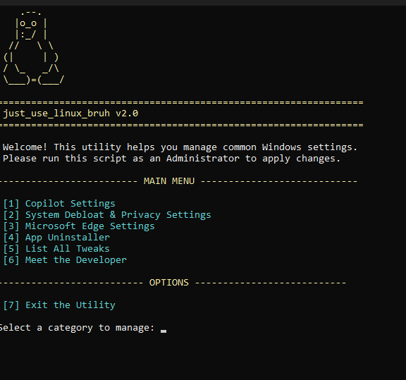

# The Official Unofficial Manual for `just_use_linux_bruh.bat`

> "For those moments when you look at your own operating system and ask, 'But why, though?'"

---

### **► Intro: What is this thing?**

Hello, weary Windows traveler.

You've found it. A magic script. A book of forbidden spells. A remote control for Windows' unending shenanigans. This little `.bat` file is your friendly little behind the screen protest against an operating system that thinks you *really* need more AI assistants, a news feed full of bs, and a fresh install of Candy Crush every other weekend.

This script helps you tell Windows, "No, thank you," and actually mean it.

---

### **► Pre-Flight Checklist: Before You Poke the Bear...**

A wise person once said, "Measure twice, cut once." An even wiser person said, "Make a backup before you let a script named `just_use_linux_bruh` mess with your computer."

**1. The "Oopsie-Daisy" Failsafe (System Restore)**
This is your "Get Out of Jail Free" card. If you tweak a little too hard and something feels weird, you can use it to turn back time.
* Hit the Start Menu and type "Create a restore point."
* Follow the prompts. It takes like, 30 seconds. Do it. Seriously. Please (I don't want to be responsible for bricking your machine)

**2. The All-Access Backstage Pass (Admin Rights)**
You need to be the king, queen, queen(gender neutral) of the castle to use this script. Make sure you're logged into an account with administrator privileges, otherwise, you're just a court jester with a cool-looking file.

**3. Don't Lose the Boom Stick**
Save the `just_use_linux_bruh.bat` file somewhere you can find it, like your Desktop. 

---

### **► Ready to Go: Let the Chaos Begin!**

Time to kill co-pilot... I mean edit the registry to disable these programs. 

**0. Grab the Goods (How to Download from GitHub)**

1.  On the main GitHub page for the project, look for a green button that says **"<> Code"**. Click it.
2.  A dropdown menu will appear. Click on **"Download ZIP"**.
3.  Save the ZIP file to your computer.
4.  Find the downloaded ZIP file and **right-click** on it, then select **"Extract All..."**. This will create a folder with the script inside.

**1. Awaken its Ancient Powers (Run as Admin)**
This is the most crucial step. Don't just double-click it like a normal person.
* **Right-click** on the `just_use_linux_bruh.bat` file.
* A menu will appear. Find **"Run as administrator"** and click it with gusto.
* A black window with a cool blue background should appear. If not, see "Troubleshooting" below.

**2. Navigate the Choose-Your-Own-Adventure**
* Use the number keys on your keyboard. It's like a phone menu, but less infuriating.
* Everything is explained in plain English. Just pick what you want to turn on or off and let the script do the scary parts.

---

### **► Troubleshooting: Houston, We Have a Problem?**

* **Problem:** "Windows protected your PC" popped up with a big blue screen!
    * **Cause:** This is Windows Defender's "SmartScreen" filter. It does this for almost any script downloaded from the internet that isn't from a huge corporation. It **does not** mean the file is a virus.
    * **Solution:**
        1.  On the blue screen, do **not** click "Don't run".
        2.  Click the underlined text that says **`More info`**.
        3.  The window will change, and a new button will appear at the bottom. Click **`Run anyway`**.
        4.  You will only have to do this once.

* **Problem:** "I ran it and the window vanished faster than my motivation on a Monday!"
    * **Cause:** Your antivirus thought our script was having too much fun and shut the party down. It saw a script trying to change system settings and, to be fair, got a little suspicious.
    * **Solution:** You need to tell your security software to chill out. In Windows Defender, you can add an "Exclusion" for our script, basically telling it, "This one's with me." Check your security software's settings for "Exclusions" or "Exceptions."

* **Problem:** "I disabled something, but it's still there, mocking me."
    * **Cause:** Windows is stubborn. Some parts of it only check for settings when it first wakes up.
    * **Solution:** Have you tried turning it off and on again? A full **system restart** will convince Windows that you're serious.

* **Problem:** "It yelled at me about 'Administrative permissions'!"
    * **Cause:** The script is telling you, "You're not the boss of me!"
    * **Solution:** You didn't run it with the admin glow. Close the window, and go back to Step 1 of "Ready to Go." Right-click it properly this time!

---

### **► Extra Info: The Nerdy Stuff & The Fine Print**

* **How It Works:** So, what dark magic is this? It's actually just a list of commands that boss around the Windows Registry, which is like the big, messy diary of your operating system. The script uses Windows' own built-in tools to do this. No outside software, no weird installers.

* **Can I Un-Bork It?** Yep. Every "Disable" option has an "Enable" counterpart that politely deletes the rule we added, letting Windows go back to its default shenanigans.

* **Disclaimer:** Look, this script fiddles with the very soul of your computer. If your PC grows legs and walks away, or starts demanding you call it 'HAL', that's on you. Use this script at your own risk. That System Restore point we talked about? Yeah, that's your real best friend.

* **About the Developer:**
    * [Come meet me on my Discord!](https://discord.gg/JtQ2QTfjXt)
  

Made with 💙 by: [AthenaRebel](https://atxyz.dev/)

